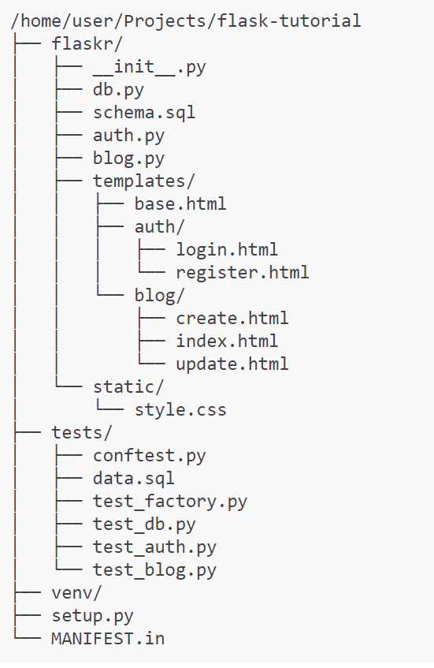
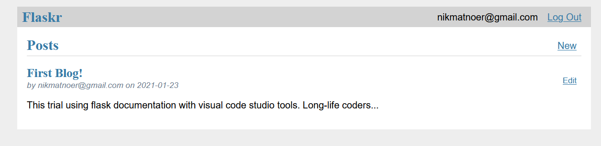

# Built Basic Blog Application using Flask

The Flask documentation is a micro web framework written in the Python programming language. Some of the applications that use flask as their framework are Pinterest, LinkedIn, and the Flask website. More information can find on the [Flask tutorial](https://flask.palletsprojects.com/en/1.1.x/).

The purpose of this repository is to build a website using Flask documentation. 

Flask relies on the [Jinja](https://www.palletsprojects.com/p/jinja/) template engine and the [Werkzeug](https://www.palletsprojects.com/p/werkzeug/) WSGI  toolkit. Documentation for this library could find at:

  - [Jinja documentation](http://jinja.pocoo.org/docs)
  - [Werkzeug documentation](https://werkzeug.palletsprojects.com/)

## Virtual Environments

*Create an environment*

Create a project folder and a venv folder within:
  
    $ mkdir myproject
    $ cd myproject
    $ python3 -m venv venv
  
On Windows:

    $ py -3 -m venv venv

using Python 2
  
    $ python2 -m virtualenv venv

outlook on windows 

    > \Python27\Scripts\virtualenv.exe venv
  

## Activate the Environment

On Windows

    > venv\Scripts\activate
    
## Install Flask

On Windows

    $ pip install Flask
 
## Install virtualenv

On Windows, as an administrator:

    > \Python27\python.exe Downloads\get-pip.py
    > \Python27\python.exe -m pip install virtualenv
    
## Project Layout
As an initial reference, it is necessary to know the project layout. To make it easier to compile the required code.

In the end, the project layout for this repository should look like this:

## Outcomes

